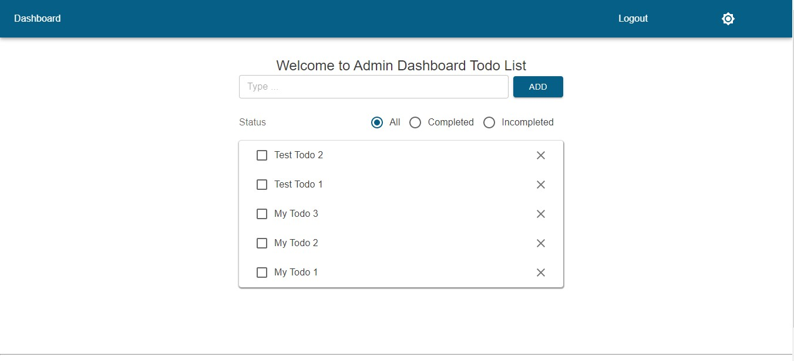

# Next.JS + Hasura + Heroku database + GraphQL Codegen + React-Query

## The idea behind the example

[Heroku Postgres](https://www.heroku.com) database storage with [Hasura GraphQL](https://hasura.io) query API are becoming increasingly popular among cloud services. Heroku currently offers a free hobby account, so we'll take advantage of it while it's still available. In this project example, we will update our previous [Firebase/Firestore](https://github.com/tamvo22/next-firebase-auth) app example by connecting to Hasura and Heroku databases and implementing GraphQL CRUD operations for our Todo List using [GraphQL Codegen](https://www.the-guild.dev/graphql/codegen) to perform real-time data updates.

## Feedback

Please leave a message on my portfolio website. Your comments are always appreciated and aid my quest for knowledge.
[https://tamvo.vercel.app/](https://tamvo.vercel.app/)

## Starter project

This project app will be an extension of our previous [NextAuth Authentication + Firebase/Firestore](https://github.com/tamvo22/next-firebase-auth) app. It is recommended to follow the app example to setup your Google Cloud Firebase/Firbase Admin API, Github and Google Provider information.

[Live App Example - https://hasuragraphql.vercel.app](https://hasuragraphql.vercel.app)



## Objective

The goal of this project app is to use GraphQL Codegen to generate Hasura API methods to perform real-time CRUD updates to the Heroku database to our Todo list. Our authentication procedure will remain the same as before with NextAuth and Firebase/Auth for credential login. Therefore, it is recommended to setup your Google Cloud Firebase/Firbase Admin API, Github and Google Provider information. Furthermore, the live app hosted on the vercel demonstrates the completed app with the admin having full control over all the user's todos. I hope that users will respect the application and refrain from entering inappropriate todo names.😉

To achive our goal, we will need to do the following:

- Improve the app with state management libraries

- Set up a Heroku and Hasura account, and deploy Hasura to the Heroku database

- Set up Hasura's database table schema, permissions and validate Queries

- Generate GraphQL Todos Queries

- Create server Account and User query functions

- Update NextAuth to use Hasura database

- Generate Hasura custom claims JWT access token

- Replace NextAuth useSession with React-Query and Jotai

- Implement our custom GraphQL API fetcher function

- Setup GraphQL environment variable, .env, and Codegen configuration

- Implement Hasura real-time subscription

- Compile useTodos hook function

- Update the Todo component

- Additional updates changes

## Let's get started

### Improve the app with state management libraries

To assist with our implementation requirements for our app, we will install the following libraries:

- [React-Query](https://tanstack.com/query/v4/?from=reactQueryV3&original=https://react-query-v3.tanstack.com) - data-fetching management library that covers fetching, caching, synchronizing, and updating server state. We will be using React-Query in conjunction with Axios to fetch our session and remote data.

- [Jotai](https://jotai.org) - a client state management library for optimizing component re-rendering and passing props without the need for a context provider. Our React-Query fetched data will be saved as a Jotai atom, which can be accessed from anywhere in our app.

- [Jose](https://github.com/panva/jose) - a framework to assist with encrypting Hasura claims to an access JWT token required for us to communicate with our Hasura API endpoint.

- [GraphQL Codegen](https://www.the-guild.dev/graphql/codegen) - generate API methods from GraphQL schema and GraphQL operations to help speed up development time for performing database data updates.

- [env-cmd](https://www.npmjs.com/package/env-cmd) - a simple program that allows commands to be executed using an environment variables from .env file.

- [nanoid](https://github.com/ai/nanoid#readme) - generate secure unique string IDs for our user id.

### Set up a Heroku and Hasura account, and then deploy Hasura to the Heroku database.

The first step is to create a Heroku account and launch our Postgres database. Here's a great [tutorial](https://dev.to/prisma/how-to-setup-a-free-postgresql-database-on-heroku-1dc1) on how to create a Heroku account. Then, we need to set up our Hasura account. Hasura's [documentation](https://hasura.io/docs/latest/getting-started/getting-started-cloud) on how to get started with creating an account is excellent. Following the creation of both accounts, use Hasura's [One-Click Heroku Deployment](https://hasura.io/docs/latest/deployment/deployment-guides/heroku/#heroku-one-click) tool to instantly connect your Hasura account to the Heroku database. Isn't that too simple?

### Set up Hasura's database table schema, permissions and validate Queries

It's time to start working on the Hasura table schema. You can quickly set up the Todos table for our project using the SQL statement below, or you can manually construct the table using the Hasura Console. The SQL query below will build the **Users**, **Accounts**, and **Todos** data tables in a similar way that we did in our Firestore example. We can omit defining the session and verificationToken tables because we're using a NextAuth JWT session. Because we will continue to use Firebase/Auth to provide password credential login, we must ensure that our users' table primary key id is declared as **TEXT** rather than **UUID** because they use different id standards. Our todo's primary key id is defined as SERIAL, which is an incremental integer id so we can order by "desc".

Postgres SQL

```sql

CREATE EXTENSION IF NOT EXISTS pgcrypto;
SET check_function_bodies = false;
CREATE TABLE users (
    id TEXT PRIMARY KEY
    name TEXT,
    email TEXT UNIQUE,
    "emailVerified" TIMESTAMP with time zone,
    image TEXT,
    role TEXT DEFAULT "user"
);
CREATE TABLE accounts (
    id uuid PRIMARY KEY DEFAULT public.gen_random_uuid(),
    type TEXT NOT NULL,
    provider TEXT NOT NULL,
    "providerAccountId" TEXT NOT NULL,
    refresh_token TEXT,
    access_token TEXT,
    expires_at BIGINT,
    token_type TEXT,
    scope TEXT,
    id_token TEXT,
    session_state TEXT,
    oauth_token_secret TEXT,
    oauth_token TEXT,
    refresh_token_expires_in INTEGER,
    "userId" TEXT NOT NULL,
    FOREIGN KEY ("userId") REFERENCES users(id) ON UPDATE RESTRICT ON DELETE CASCADE
);
CREATE TABLE todos (
    id SERIAL PRIMARY KEY,
    name TEXT NOT NULL,
    "completed" BOOLEAN DEFAULT false,
    "userId" TEXT NOT NULL,
    FOREIGN KEY ("userId") REFERENCES users(id) ON UPDATE RESTRICT ON DELETE CASCADE
);

```

After the tables have been created, we must configure the Todos table user role access permissions. We will reference the Todos' _userId_ field to the user's session id "X-Hasura-User-Id" to ensure the user only has access to their own Todos information, except the admin account role, which will have access to all the user's Todos. The following are the security settings for Insert, Select, Update, and Delete.

- Insert:

  - Row insert permission: { "uid": { "\_eq": **"X-Hasura-User-Id"**} }
  - Column insert permissions: check all except _id_

- Select:

  - Row insert permission: _same as Insert row permission_
  - Column insert permissions: check all except _userId_

- Update:

  - Row insert permission: (pre-update check) _same as Insert row permission_
  - Column insert permissions: only check _name_ and _completed_

- Delete:
  - Row insert permission: _same as Insert row permission_


We'd like to validate our table by running a few queries through the Hasura GraphiQL Tool. Try a few AddTodos mutations and then run a query to get a list of all Todos for a sample userId. Test UpdateTodos and DeleteTodos to see if they are also working correctly. These queries and mutations will also be used to update our Todos table in the next part of our app.

- subscription: Subscibe a query to the server for realtime updates

- query: GraphQL query enclosed with backticks(`) use to fetch data

- mutation: GraphQL mutions are used to modify data on the server (i.ie. insert, upsert, update, or delete data)

- variables: Optional parameters for queries and mutations to request or perform specific operations

```graphql
Queries:
# get Todos
{
  query getTodosWhere($where: todos_bool_exp!) {
    todos(where: $where, order_by: { id: desc }) {
      id
      name
      completed
    }
  }
}
Variables:
{
  "where": {}
}

Mutations:
# Add a todo with object name and userId
{
  mutation AddTodos($object: todos_insert_input!) {
    insert_todos_one(object: $object) {
      id
      name
      completed
    }
  }
}
Variables:
{
  "object": { "name": "Some Todo", "userId": "some_userId" }
}

# Update a todo by id
{
  mutation UpdateTodos($where: todos_bool_exp!, $set: todos_set_input) {
    update_todos(where: $where, _set: $set) {
      affected_rows
      returning {
        id
      }
    }
  }
}
Variables:
{
  "where": { "id": { "_eq": 1 } },
  "set": {
    "completed": true
  }
}

# Delete a Todo by id
{
  mutation DeleteTodosById($id: Int!) {
    delete_todos_by_pk(id: $id) {
      id
    }
  }
}
Variables:
{
  "id": 1
}


```


### Generate GraphQL Todos Queries

Once the Todos queries and mutations have been tested and validated, we can create the Todos graphql query file, which Codegen will need to generate the GraphQL API functions. The essential Todos queries are the same as what we tested above, but without the variables. The variables will be the generic values provided by the end user's input. See the completed Todo query file [Todos.graphql](src/_utils/hasura/queries/Todos.graphql) and reference [Hasura Queries Docs](https://hasura.io/docs/latest/queries/postgres/simple-object-queries) for additional information.

[Todos.graphql](src/_utils/hasura/queries/Todos.graphql)

```graphql
...

# get Todos query
query getTodosWhere($where: todos_bool_exp!) {
  todos(where: $where, order_by: { id: desc }) {
    id
    name
    completed
  }
}
...

```

### Create server Account and User query functions

Since we are migrating from Firebase/Firstore to Hasura database, we'll need to update our NextAuth firestoreAdapter.ts to [hasuraAdapter.ts](src/_utils/auth/hasuraAdapter.ts) to keep track of the user accounts and profiles for the media logins. However, before we can use our Hasura API call functions, we must first implement the server fetcher function listed below. Pease note that this fetcher function will operate on the server, so we will need to supply it with _'X-Hasura-Admin-Secret': process.env.HASURA_ADMIN_SECRET!_ in the header for it to work.

[fetcher.ts](src/_utils/hasura/server/fetcher.ts)

```jsx
export interface HasuraQuery {
  query: string;
  variables: {};
}

export async function serverFetcher({ query, variables }: HasuraQuery) {
  const axiosServer = axios.create();

  const result = await axiosServer(process.env.HASURA_API_ENDPOINT!, {
    method: 'POST',
    headers: {
      'Content-Type': 'application/json',
      'X-Hasura-Admin-Secret': process.env.HASURA_ADMIN_SECRET!,
    },
    data: {
      query,
      variables,
    },
  });

  return result.data;
}
```

Once we have our fetcher function, we can write the Hasura API call functions for both the users.ts and accounts.ts. Here, we have to write the API call functions and query statements ourselves. But it will provide us with the basic information we need to perform GraphQL updates. After we set up Codegen later, we will simply need to define the Todos query statements, and Codegen will generate the API call functions for us, saving us a significant amount of time and effort in the long run.

[accounts.ts](src/_utils/hasura/server/accounts.ts)

```jsx
export const queryGetAccount = async (where: {}): Promise<Account | null> => {
  const query = {
    query: `
      query getAccount($where: accounts_bool_exp!) {
        accounts(where: $where, limit: 1) {
          userId
        }
      }`,
    variables: {
      where,
    },
  };

  const res = await serverFetcher(query);

  return res.data.accounts[0] as Account;
};
```

[users.ts](src/_utils/hasura/server/users.ts)

```jsx
export const getUser = async (id: string): Promise<AdapterUser | null> => {
  const query = {
    query: `
      query getUserById($id: String!) {
        users_by_pk(id: $id) {
          id
          name
          email
          emailVerified
          image
          role
        }
      }`,
    variables: {
      id,
    },
  };

  const user = await serverFetcher(query);

  return user.data.users_by_pk as AdapterUser;
};
```

### Update NextAuth to use Hasura database

Similar to the previous firestoreAdapter function, we will setup the API calls for the Hasura API call functions. Hence, since we are using the JWT session method, we do not need to implement the Session and verificationToken sections.

[hasuraAdapter.ts](src/_utils/auth/hasuraAdapter.ts)

```jsx
export default function HasuraAdapter(): Adapter {
  return {
    async createUser(user) {
      const { id } = await createUser(user);
      return { ...user, id } as AdapterUser;
    },
    async getUser(id) {
      return await getUser(id);
    },
    async getUserByEmail(email) {
      return await queryGetUser({ email: { _eq: email } });
    },
    async getUserByAccount({ provider, providerAccountId }) {
      const account = await queryGetAccount({ provider: { _eq: provider }, providerAccountId: { _eq: providerAccountId } });
      if (!account) return null;

      return await getUser(account?.userId!);
    },
    async updateUser(partialUser) {
      return await updateUser(partialUser);
    },
    async deleteUser(userId) {
      return await deleteUser(userId);
    },
    async linkAccount(account) {
      return await createAccount(account);
    },
    async unlinkAccount({ provider, providerAccountId }) {
      await queryDeleteAccount({ provider: { _eq: provider }, providerAccountId: { _eq: providerAccountId } });
    },

    ...

  }
}
```

### Generate Hasura custom claims JWT access token

Next, we'll need to generate [Hasura claims](https://hasura.io/docs/latest/auth/authentication/jwt/) in order to authorize user access to the Hasura API endpoint. In our nextauth api route, we'll use the Jose library's **EncryptTokens()** method to encrypt the user's Hasura claims and pass them along with the user's JWT session, just like we did in our previous example with createCustomToken() and signInWithCustomToken() for Firebase/Firestore.One thing to keep in mind for client Hasura API access is that it requires both the accessToken and the user's role. For new media login users who do not have a user role, their role will be set to the "user" role by default.

On the user's first login, we will generate the Hasura claims and the **accessToken** and **tokenExpires** to determine if the accessToken needs to be renewed.We simply return the same accessToken if the tokenExpires is still valid.

In the Session Callback, we will return the user, accessToken, and tokenExpires along with the session.

[hasuraClaims.ts](src/_utils/auth/hasuraClaims.ts)

```jsx
// src/_utils/auth/hasuraClaims.ts
export function hasuraClaims(user: User) {
  const jwtClaims = {
    ...user,
    'https://hasura.io/jwt/claims': {
      'x-hasura-allowed-roles': ['admin', 'user'],
      'x-hasura-default-role': 'user',
      'x-hasura-role': user.role ?? 'user',
      'x-hasura-user-id': user.id,
    },
  };

  return jwtClaims;
}
```

[encryptToken.ts](src/_utils/auth/encryptToken.ts)

```jsx
// src/_utils/auth/encryptToken.ts
export async function EncryptTokens(token: JWTPayload, secret: string) {
  const iat = new Date().getTime() / 1000;

  const accessToken = await new SignJWT(token)
    .setProtectedHeader({ alg: 'HS256' })
    .setJti(nanoid())
    .setIssuedAt(iat)
    .setExpirationTime('1hr')
    .sign(new TextEncoder().encode(secret));

  const tokenExpires = iat + 60; // 1 hour

  return { accessToken, tokenExpires };
}
```

[`[nextauth].ts`](pages/api/auth/%5B...nextauth%5D.ts)

```jsx
// pages/api/auth/[nextauth].ts
callbacks: {
  async jwt({ token, user }) {
    if (token.tokenExpires && new Date().getTime() / 1000 < token.tokenExpires) {
      return token;
    }

    // generate Hasura claims on first login
    if (user) {
      token.user = { ...user, role: user?.role ?? 'user', ...hasuraClaims(user as User) };
    }

    // generate hasura accessToken for Hasura authorization
    const { accessToken, tokenExpires } = await EncryptTokens(token.user, process.env.HASURA_JWT_SECRET!);
    token = { ...token, accessToken, tokenExpires };

    return token;
  },
  async session({ session, token }) {
    session.user = token.user;
    session.accessToken = token.accessToken;
    session.tokenExpires = token.tokenExpires;

    return session;
  },
},
```

### Replace NextAuth useSession with React-Query and Jotai

Since we are using React-Query and Jotai to help us manage our client/server states, we will create our own useSession hook. Therefore, we will exclude NextAuth's useSession hook and SessionProvider usage from our app. Instead, we'll integrate an all-in-one Jotia/React-Query method called [**atomWithQuery**](https://jotai.org/docs/integrations/query) to streamline the entire session fetching process. In our layout component, we will call this useSession to keep track of the client's session. The reason for choosing the client session fetching approach in our example is due to unstable future changes regarding NextAuth SSR [**unstable_getServerSession**](https://github.com/nextauthjs/next-auth/issues/4741) implementation.

The custom useSession will allow immediate access to the user's session object from anywhere in our app by calling the **SessionAtomRef** atom. We will also redirect invalid sessions to relogin as well as check/renew our accessToken every 30 minutes by calling _"refetchInterval"_. This way, the user will never get a timeout of Hasura API access due to an expired accessToken while their session exists. At this point, we should be able to log into our dashboard again.

[useSession.ts](src/_utils/auth/useSession.ts)

```jsx
// src/_utils/auth/session.ts
export async function fetchSession(): Promise<Session | null> {
  const { data } = await axios.get('/api/auth/session');

  if (!data?.error) {
    if (Object.keys(data!).length) {
      return data;
    }
  }

  return null;
}

// atom reference to session object, access from anywhere in our app
export const SessionAtomRef = atom<Session | null | undefined>(undefined);

export const useSession = () => {
  const router = useRouter();

  const setSessionRef = useUpdateAtom(SessionAtomRef);
  const session = useAtomValue(
    useMemo(() => {
      return atomWithQuery((get) => ({
        queryKey: ['session'],
        queryFn: fetchSession,
        retry: true,
        refetchOnMount: true,
        refetchOnWindowFocus: true,
        refetchOnReconnect: true,
        refetchIntervalInBackground: true,
        refetchInterval: 30 * 60 * 1000, // refresh accessToken every 30 minutes
        onSettled(data: Session | null | undefined, error: unknown) {
          if (data) {
            // save session to our SessionAtomRef atom
            setSessionRef(data);
          } else {
            // redirect to login if session expired
            router.push('/login');
          }
        },
      }));
    }, []),
  );

  return session;
};
```

### Implement our custom GraphQL API fetcher function

It is time to setup Codegen for our Todos data updates. We will need to implement a custom fetcher for Codegen and the React-Query plugin to work correctly. Codegen has not yet exposed the React-Query custom fetcher **options** properties for us to provide the authorization header for our data fetching at the time of this example guide. However, because we can access SessionAtomRef from anywhere in our app, we only need to configure [Codegen custom hook Fetcher](https://the-guild.dev/graphql/codegen/plugins/typescript/typescript-react-query#using-custom-fetcher) example to use hooks so that we can call our SessionAtomRef atom to get accessToken and user role for the authorization header.

[useFetcher.ts](src/_utils/hasura/generated/useFetcher.ts)

```jsx
// src/_utils/hasura/generated/fetcher.ts
export const useFetcher = <TData, TVariables>(query: string, options?: RequestInit['headers']): ((variables?: TVariables) => Promise<TData>) => {

  // access to our session to get accessToken and user role for our header
  const session = useAtomValue(SessionAtomRef);

  return async (variables?: TVariables) => {
    const res = await axiosClient(process.env.HASURA_API_ENDPOINT!, {
      method: 'POST',
      headers: {
        'Content-Type': 'application/json',
        Authorization: `Bearer ${session?.accessToken}`,
        'x-hasura-role': session?.user.role,
        ...(options as any),
      },
      data: {
        query,
        variables,
      },
    });

    return res.data;
  };
};
```

### Setup GraphQL environment variable, .env, and Codegen configuration

We'll need to add a Hasura server environment variable called **JWT_SECRET={ "type": "HS256", "key": "same as your HASURA_JWT_SECRET secret" }** during this phase. This key secret needs to match the **HASURA_JWT_SECRET** that we use to encrypt our accessToken JWT token or else Hasura API endpoint from returning the error: **JWT: JWSError JWSInvalidSignature**. We will need to provide the rest of the Hasura API environment variables as well. You can refer to [Next.JS environment variable](https://nextjs.org/docs/basic-features/environment-variables#default-environment-variables) for additional information on how to configure your .env file. It is recommended that you can rename your .env file to the .env.local so that your key secret will not get expose to the client.

[.env.local](.env)

```env
## Hasura API
HASURA_ADMIN_SECRET=
HASURA_JWT_SECRET=
DATABASE_URL=
HASURA_API_ENDPOINT=

```

It's finally time to set up our codegen.ts file to use our custom fetcher function. It will use the Hasura Todos queries that we created earlier in [Todos.graphql](src/_utils/hasura/queries/Todos.graphql) with remote database schemas and Typscript plugins to generate Hasura API hook functions for us. Please refer to [codegen.ts configuration](https://www.the-guild.dev/graphql/codegen/docs/config-reference/codegen-config) for more information. In addition to the general setup configuration, we must set the two properties below for our app to work.

- isReactHook: Enables us to turn our custom fetcher into a hook function that can call other hook functions.

- exposeQueryKeys: allows us to call query.getKey() to get the React-Query queryKey to reference our query.

[codegen.ts](codegen.ts)

```ts
const config: CodegenConfig = {
  overwrite: true,
  documents: 'src/_utils/hasura/queries/**/*.graphql',
  generates: {
    'src/_utils/hasura/generated/graphql.ts': {
      schema: [
        {
          [`${process.env.HASURA_API_ENDPOINT}`]: {
            headers: {
              'x-hasura-role': 'admin',
              'x-hasura-admin-secret': `${process.env.HASURA_ADMIN_SECRET}`,
            },
          },
        },
      ],
      plugins: ['typescript', 'typescript-operations', 'typescript-react-query', 'typescript-resolvers'],
      config: {
        fetcher: {
          func: 'src/_utils/hasura/generated/useFetcher#useFetcher',
          isReactHook: true,
        },
        exposeQueryKeys: true,
        withHooks: true,
        withComponent: false,
        withHOC: false,
      },
    },
  },
};
```

In order to execute codegen.ts with our Hasura environment variables defined in _.env_, we will need help from _env-cmd_. After adding the following generate run script in the package.json file, we can run cli _npm run generate_ to execute the above codegen.ts file to generate our graphql.ts file. Please note, that we have _.env.local_ here, if your environment file has a different type name, you will have to change it accordingly or else it will not work.

[package.json](package.json)

```json
  "scripts": {
      "dev": "next dev",
      "build": "next build",
      "start": "next start",
      "generate": "env-cmd -f .env.local graphql-codegen --config codegen.ts"
    },
```

### Implement Hasura real-time subscription

Now that we have our hook routines for the Codegen API, we can begin updating our data. But before we do so, we're going to implement a subscription hook method so that we may leverage both Hasura regular updates and real-time updates.

We'll be using WebSocket and React-Query to implement our real-time subscription method. Thanks to [TkDodo's Blog](https://tkdodo.eu/blog/using-web-sockets-with-react-query) and [MotleyDev](https://github.com/motleydev/react-query-with-graphql-demo) for providing useful resources for getting WebSockets to work with React-Query, which helped save us a lot of time. We must provide our session atom together with the accessToken and role to the WebSocket subscription for Hasura authorization in order to successfully establish a subscription connection. We'll subscribe to the Todos query, which will provide us updates in real time anytime data changes. The subscribed data and status will be return to our useTodos() hook function. 

[useSubscription.ts](src/_utils/hasura/generated/useSubscription.ts)

```ts
// src/_utils/hasura/generated/useSubscription.ts
export const useQuerySubscription = <TVariables>(queryKey: QueryKey, query: string, variables?: TVariables) => {
  const [status, setStatus] = useState<'success' | 'loading' | 'error'>('loading');

  // get session atom state
  const session = useAtomValue(SessionAtomRef);
  const queryClient = useQueryClient();

  useEffect(() => {
    const subscribe = async () => {
      if (session) {
        const ws = new WebSocket(url, 'graphql-ws');

        const headers = {
          Authorization: `Bearer ${session?.accessToken}`,
          'x-hasura-role': session?.user.role,
        };

        // pass in our accessToken and user role
        const init_msg = {
          id: subscribeId,
          type: 'connection_init',
          payload: { headers: headers },
        };

        // subscribe to the query data
        // Whenever the data gets changed, it will notify us of the new updates.
        const msg = {
          id: subscribeId,
          type: 'start',
          payload: {
            operationName: null,
            query: query,
            variables: variables,
            extensions: {},
          },
        };

        ws.onopen = function (event) {
          ws.send(JSON.stringify(init_msg));
          ws.send(JSON.stringify(msg));
        };
        ws.onmessage = (event) => {
          const res = JSON.parse(event.data);

          if (res.type === 'data') {
            setStatus('success');

            // update our query data when new data is available
            const payload = res.payload;
            queryClient.setQueriesData(queryKey, payload.data);
          }
        };

        ws.onclose = function (e) {
          // reconnecting on socket expires
          setTimeout(function () {
            subscribe();
          }, 1000);
        };

        return () => {
          ws.send(JSON.stringify({ id: subscribeId, type: 'stop' }));
          ws.close();
        };
      }
    };

    subscribe();
  }, [queryClient]);

  return status;
};
```

### Compile useTodos hook function

Now that we've created our useSubscription hook function, let's combine it with the Codegen hook routines to supply us with both regular and real-time data updates for our useTodos hook function. The **subscribe** props variable will determine if the function will use regular or real-time updates. For regular updates, Codegen provides us with mutation hooks for add, update, and delete that we can easily use to perform our mutation update requests. We will be using Codegen generated hooks: **useGetTodosWhereQuery**, **useAddTodoMutation**, **useUpdateTodosWhereMutation**, and **useDeleteTodosByIdMutation**. Since Codegen generated it's own queryKey, we would have to use **useGetTodosWhereQuery.getKey(variables)** to get the same queryKey for all the hook calls to update the same queryKey. 

By default Hasura live query subscription updates are delivered to clients every **1** sec. In order to speed up the updates, we can modify the Hasrua environment variable **HASURA_GRAPHQL_LIVE_QUERIES_MULTIPLEXED_REFETCH_INTERVAL** to 0 milliseconds for immediate updates.

[useTodos.ts](src/_utils/hasura/generated/useTodos.ts)

```jsx
// src/_utils/hasura/generated/useTodos.ts
...

// intiate Hasura subscription with default GetTodos
const useTodos = ({ subscribe = false }: { subscribe?: boolean } = {}) => {
  const queryClient = useQueryClient();

  // get document from codegen file
  const queryDocument = subscribe ? GetTodoSubscribeDocument : GetTodosWhereDocument;

  const variables = {
    where: {},
  };

  // get Codegen queryKey
  const queryKey = useGetTodosWhereQuery.getKey(variables);

  // set queryClient staleTime to Infinity if using subscription else reset to default of 0
  subscribe ? queryClient.setQueryDefaults(queryKey, { staleTime: Infinity }) : queryClient.setQueryDefaults(queryKey, { staleTime: 0 });

  // get loading status of subscription
  const subStatus = subscribe && useQuerySubscription(queryKey, queryDocument, variables);

  // perform subscription or regular query updates
  const { data, status } = subscribe
    ? useQuery(queryKey, () => [] as Todos[], {
        enabled: true,
        refetchOnMount: false,
        refetchOnWindowFocus: false,
        refetchOnReconnect: false,
        refetchIntervalInBackground: false,
      })
    : useGetTodosWhereQuery(variables, {
        enabled: true,
        refetchOnMount: true,
        refetchOnWindowFocus: true,
        refetchOnReconnect: true,
        refetchIntervalInBackground: false,
      });

  // react-query options
  const queryOptions = {
    retry: 1,
    ...(!subscribe && {
      onSuccess: (data: any) => {
        // force refetch todos for regular queries
        queryClient.invalidateQueries(queryKey);
      },
    }),
  };

  // Add a new todo
  const mutateAddTodo = useAddTodoMutation(queryOptions);
  const addTodo = (todo: Partial<Todos>) => {
    const { id, ...rest } = todo;

    mutateAddTodo.mutate({
      object: {
        ...rest,
      },
    });
  };

  // Update a todo
  const mutateUpdateTodoWhere = useUpdateTodosWhereMutation(queryOptions);
  const updateTodo = (todo: Partial<Todos> & Required<Pick<Todos, 'id'>>) => {
    const { id, ...rest } = todo;

    mutateUpdateTodoWhere.mutate({
      where: { id: { _eq: id } },
      set: {
        ...rest,
      },
    });
  };

  // Delete a single Todo
  const mutateDeleteTodosById = useDeleteTodosByIdMutation(queryOptions);
  const deleteTodo = (todo: Partial<Omit<Todos, 'name' | 'completed'>>) => {
    mutateDeleteTodosById.mutate({
      id: todo?.id!,
    });
  };

  // multiple data properties since both React-Query and Hasura GraphQl returns data
  return { data: subscribe ? data : (data as any)?.data, status: subscribe ? subStatus : status, addTodo, updateTodo, deleteTodo };
};

```

### Update the Todo component

The final step in finalizing our project is to call the useTodos hook and pass the mutation methods addTodo, updateTodo, and deleteTodo to the TodoList component. We will also need to update the TodoList's handle add, update, and delete functions to call useTodos hooks. We can test our dashboard's Todo component by performing both regular and real-time updates to see how it updates.

[Dashboard](pages/dashboard/index.tsx)

```jsx 
const Dashboard = () => {
  const todos = useTodos({ subscribe: true });
  const { data, status, addTodo, updateTodo, deleteTodo } = todos;

  return (
    <Container sx={{ mt: '2rem', mb: '4rem' }} maxWidth={'sm'}>
      <Typography variant="h5" component="h2" align="center">
        Welcome to Admin Dashboard Todo List
      </Typography>
      <TodoList todos={data?.todos!} loading={status === 'success' ? true : false} addTodo={addTodo} updateTodo={updateTodo} deleteTodo={deleteTodo} />
    </Container>
  );
};

```

[TodoList component](src/components/ui/TodoList/index.tsx)

```tsx
//src/components/ui/TodoList/index.tsx
const TodoList = ({ todos, loading, addTodo, updateTodo, deleteTodo }: TodoListProps) => {
  // get session user.id
  const session = useAtomValue(SessionAtomRef);
  const userId = session?.user.id!;

 ...

  const handleAddTodo = (event: React.FormEvent<HTMLFormElement>) => {
    event.preventDefault();

    const name = event.currentTarget.addTodo.value.trim();
    event.currentTarget.addTodo.value = '';

    if (name) {
      // pass along the uid from session user.id to indentify the user's todos
      const newTodo = { name, userId: userId };
      addTodo(newTodo);
    }
  };

  const handleSetTodo = (action: string, todo: Partial<Todos> & Required<Pick<Todos, 'id'>>) => {
    if (action === 'UPDATE') {
      updateTodo(todo);
    } else if (action === 'DELETE') {
      deleteTodo(todo);
    }
  };

  ...

};

```

## Conclusion

This concludes our app example guide. In conclusion, our app demonstrates how to use GraphQL Codegen to generate Hasura API methods to provide both regular and real-time updates for our Todos component. We also get to integrate React-Query and Jotai to help us with data state management, which makes the entire process simpler. I hope that this project app has shown some intriguing techniques that we may use in our next app. I will continue to create a lot more intriguing and exciting apps in the near future.

